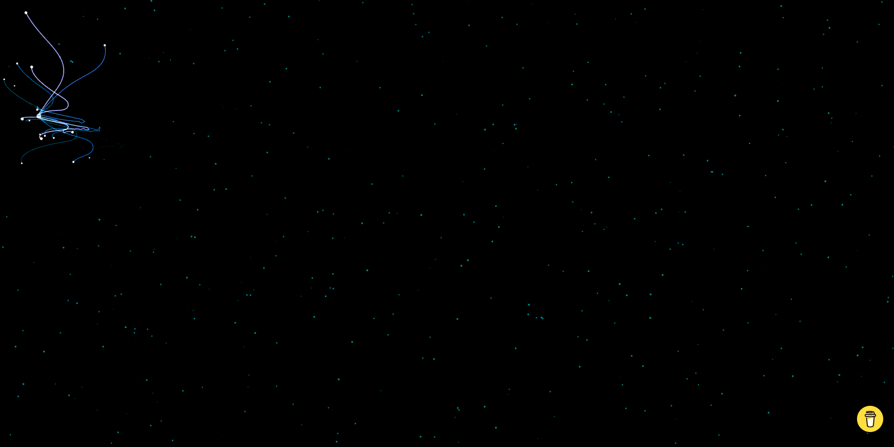
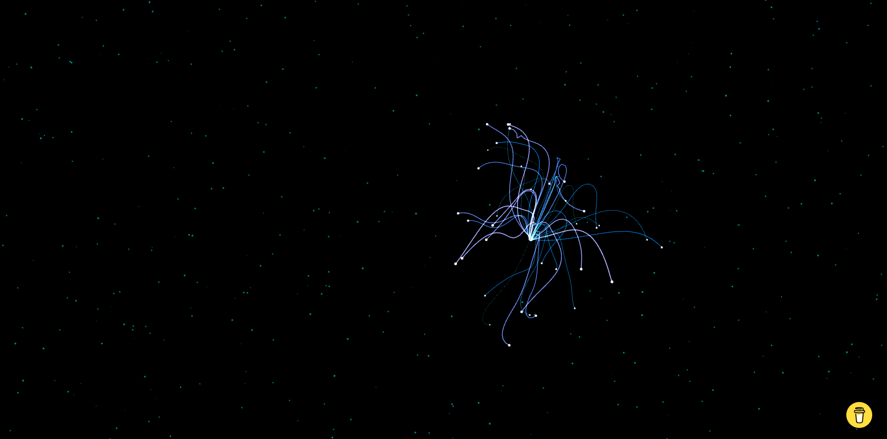

# Monster Eléctrico

A Pen created on CodePen.io. Original URL: [https://codepen.io/brusespinal/pen/VwdjRxY](https://codepen.io/brusespinal/pen/VwdjRxY).

I developed a similar code by modifying various elements, inspired by a project I'm working on with the Digital Learning and Inquiry (DLINQ) ITS department at Middlebury College. The project involves creating a website for them, scheduled for June 24, 2024. I incorporated this concept into the header because I believed adding some technology and motion would enhance the ITS website.

Support
-------
If you like my work and wish to support it, feel free to buy me a coffee!

  

